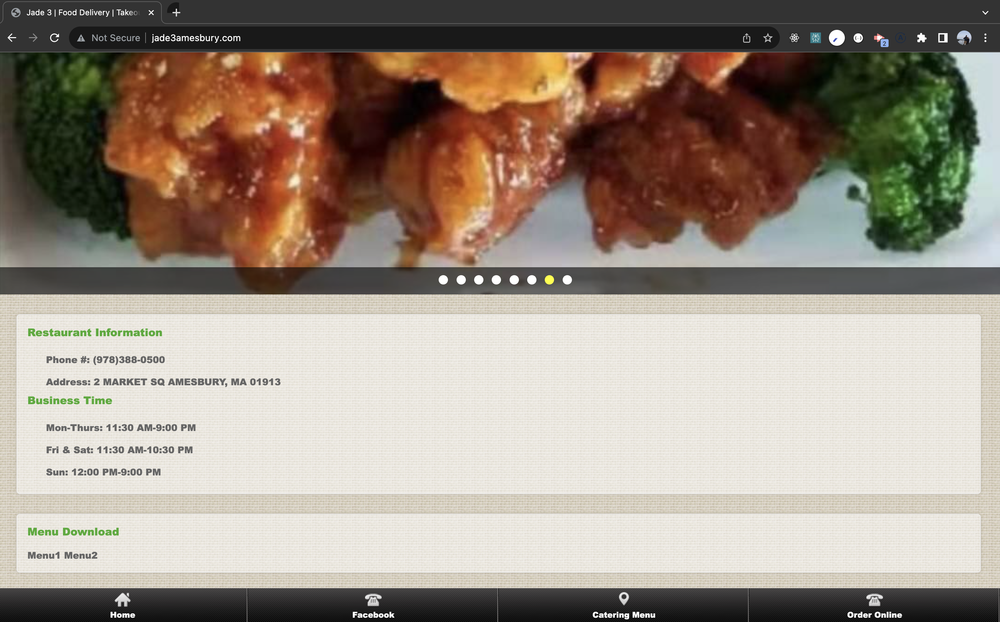
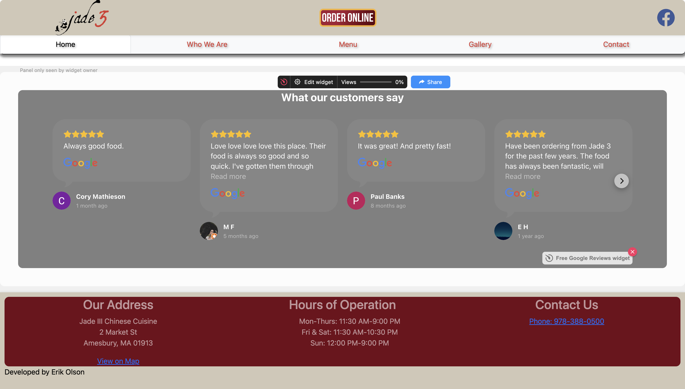

# Jade 3

## Description

I didn't love the look of my local Chinese food restaurants website, so i began to remake it. This is a static react website, that when finished, I will offer to the restaurant free of charge.
I hope to implement a stripe payment system in the future as their current payment website declares itself as "unsecure" in the address bar.

This project is proudly a work in progress.

## Comparisons

- This is Currently the top half of Jade 3's website.
  

- This is how I would have designed the website with my skills at the time.
  

- The current footer of Jade3.
  

- How I would have designed the footer.
  

## Next Up Implementations

- Next to the carousel menu on the home page, I need to come up with more information to display.
- Implement Stripe

## The UX/UI design is currently in placeholder status, once the site is functional, a design overhaul will take place.
